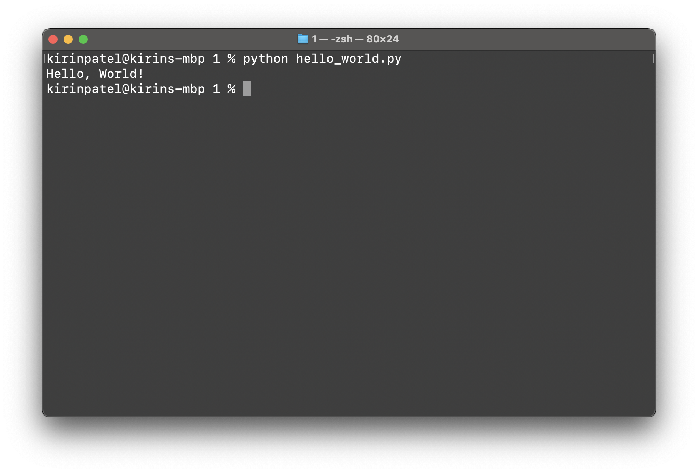

# Hello, World! (Lesson 1)

Just as many before you, and many after you, programmers almost exclusively
start their journey by printing "Hello, World!" to the terminal. It is the
defacto way to get introduced to a language as it teaches you basic syntax and
methods of interaction with a language.

To begin, start by creating a new Python file, name it **hello_world.py**. Once
you have created the file, open it in a text editor/IDE of your choice, I
recommend [Visual Studio Code](https://code.visualstudio.com).

Once within your text editor/IDE of choice, take a look at the new file, it is a
blank canvas for endless possibilities! To begin, we will utilize the
[print](https://docs.python.org/3/library/functions.html#print) function to
print a string to a terminal. While you do not need to know the explicit
workings of the print function for now, I have included a link to the
documentation so that you can begin to familiarize yourself with Python's
documentation. However, you should become familiar with data types, especially
strings. Details can be found in the
[Data Types & Structures](../../../readings/data_types_and_structures.md)
reading.

It's time to write code! Let's get started by writing the following, then
analyzing what we are doing.

```Python
print("Hello, World!")
```

In the code above, we are calling the print function and providing
**"Hello, World!"** as a parameter. This is quite important to understand,
functions execute code based on provided parameters, in the case of the print
function, it will print the provided parameter to the terminal.

Finally, let's execute the code to solidify our understanding of what we have
just written. To execute Python code, you must first open your terminal, then you
can run the following:

```Bash
python hello_world.py
```

You should now be rewarded with a response!



## Troubleshooting Errors

### can't open file 'hello_world.py': [Errno 2] No such file or directory

Your terminal is likely not in the same directory as your python file. To fix this
you can either move your terminal to the directory that has your python file
**OR** specify the path where your python file is located to the terminal.

If you want to change the directory that your terminal is currently referencing
you can use the
[**cd**, change directory, command](<https://en.wikipedia.org/wiki/Cd_(command)>).
You can use it as follows

```Bash
# Move into a directory
cd child_directory

# Move back into a parent directory
cd ..

# Reset to your home directory
cd ~

# Go to an explicit directory
cd /a/b/c
```

Should you want to just specify the path of the python file instead, you can
determine the relative path to the file or the absolute path of the file. The
relative path is the path difference between where your terminal currently is
and where the file is. The absolute path is the explicit path of the python file
within your computer. With either path, you can then run:

```Bash
# Relative path assuming terminal is in the root directory of the repository
python lessons/python/1/hello_world.py

# Absolute path assuming the python file is located in the root directory
python /hello_world.py
```

### Another Error?

Ensure that Python 3 is installed, if that does not resolve the error, open an
[issue](https://github.com/ajchili/learn-programming/issues/new).

## Additional Readings

- [Paths](<https://en.wikipedia.org/wiki/Path_(computing)#Absolute_and_relative_paths>)
