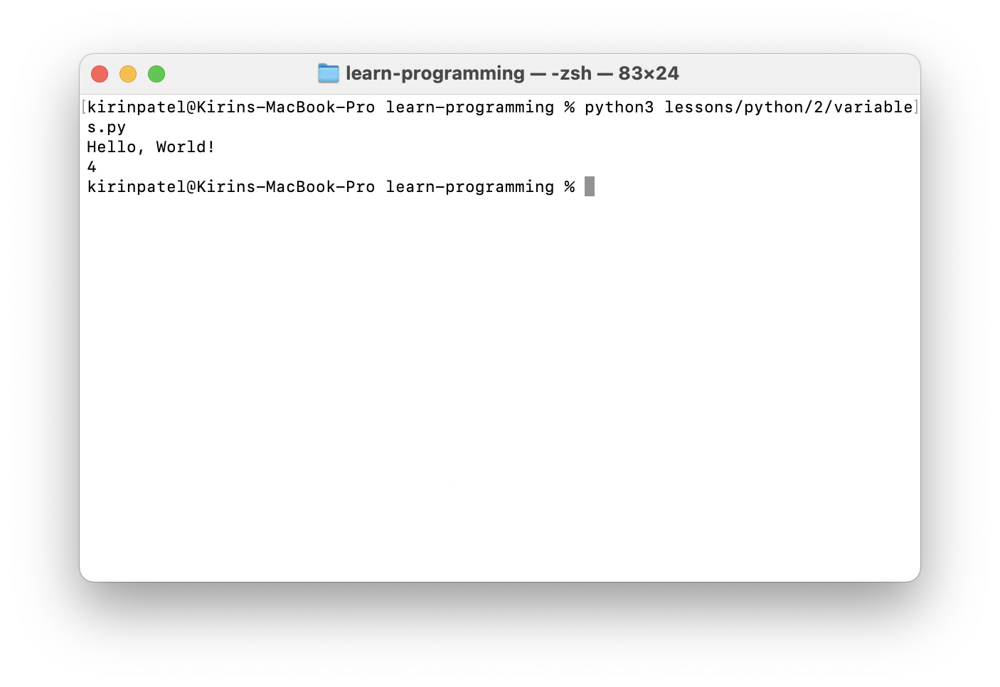

# Variables, Mutations, and Operations (Lesson 2)

Hello, World! is great, but it is basic. Programming is not limited to printing a single string to the terminal. Instead, it often requires storing data and performing operations on the data.

1. Start by creating another new Python file, you can name it **variables.py**, but in reality it does not matter what you name it.
2. Next, open the file in your editor/IDE of choice.
3. Once within your editor/IDE of choice, we will create a new variable
4. Consider what we learned in **Lesson 1**, the string which was embedded within the `print` function can be extracted to a variable, to create a variable, reference the code below
   ```python
   # Name of variable on left of the equals sign, variable value on the right
   hello = "hello"
   world = "world"
   ```
5. Now, consider that we want to work with more data than just a string, perhaps a number!
   ```python
   # Example variable with an integer value
   some_number = 2
   ```
6. Lastly, we can perform mutations and operations on these variables. We can perform a multitude of operations on these variables, including addition, subtraction, multiplication, etc.
   ```python
   combined_words = "a" + "b" # will become "ab"
   some_new_number = 2 + 2 # will be 4
   some_other_number = some_new_number + 2 # will be 6
   ```
7. Finish up the assignment by doing the following:
  1. Printing **Hello, World!** using a variable per word with the add operation for a string
  2. Printing an integer variable which was initialized to `2` then had been doubled (`2` added to it or multiplied by `2`)
8. Run your program!
   ```bash
   python variables.py
   ```

## Expected Outcome

