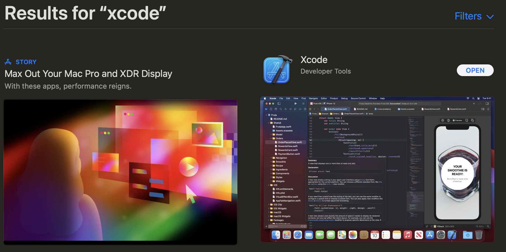

# Setting up Xcode

Installing Xcode on a Mac device is simple. Follow the steps below to install
Xcode

1. Open the App Store on your Mac
2. If you are not already signed in with your Apple ID, do so now
3. Search for "**Xcode**" in the search bar
4. Install the result that is seen below
   
5. Wait for the installation to complete, this can take a bit of time as it is a
   large download
6. Once downloaded, open Xcode and install the command line tools
